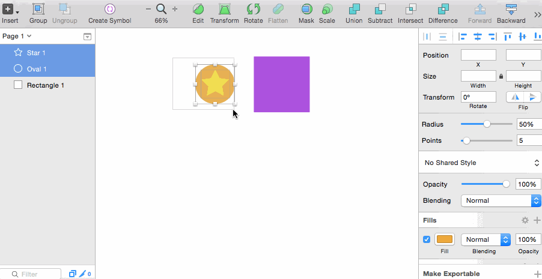

# Sketch Create Nested Symbol

This [Sketch][] plugin creates a symbol from your selection using the key command ctrl+S. Unlike the default Create Symbol action in Sketch, this plugin allows you to create symbols with existing symbols nested inside in one action.

## Warning
**Use at your own risk.**

Sketch does not recommend using nested symbols and has stated response to using nested symbols:
> If your document turns itself into a burning ball of fire, don't be surprised if the answer from our support team is: "we told you not to do that" : )

For more information, read this [Designer News article] on nested symbols in Sketch.

## Demo

[Sketch]: http://bohemiancoding.com/sketch/
[Designer News article]: https://www.designernews.co/stories/24265-psa-you-can-use-nested-symbols-in-sketch